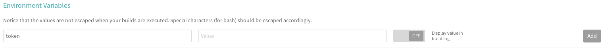

# Configuring Sphinx, GitHub pages and Travis to auto-publish code documentation.

The following are instructions to configure Sphinx, GitHub pages and Travis in order to auto-publish code documentation. This setup only is a one-time process and it can be completed in about 10 minutes.

### Create an orphan branch named gh-pages.

```
git checkout --orphan gh-pages

git rm -rf .

echo "#Title of Readme" > README.md

git add README.md

git commit -a -m "Initial commit"

git push --set-upstream origin gh-pages
```

### Activate GitHub pages in the repository settings.

In the repository settings, go to the "GitHub Pages" section and select "gh-pages branch" as the source.

<p align="center">
    <br>
</p>

### Install Sphinx.

```
pip3 install sphinx --user
```

### Execute Sphinx-quickstart.

Switch to any other branch that is not "gh-pages" (e.g. the development branch) and execute the following, changing the values accordingly.

```
sphinx-quickstart --author "Alan Verdugo" \
--project "GitHub pages demo" \
--language en \
--release "1.0" \
--ext-autodoc \
--ext-coverage \
--ext-githubpages \
--no-makefile .
```

```
Welcome to the Sphinx 2.2.0 quickstart utility.

Please enter values for the following settings (just press Enter to
accept a default value, if one is given in brackets).

Selected root path: .

You have two options for placing the build directory for Sphinx output.
Either, you use a directory "_build" within the root path, or you separate
"source" and "build" directories within the root path.
> Separate source and build directories (y/n) [n]: y

Creating file ./source/conf.py.
Creating file ./source/index.rst.
Creating file ./make.bat.

Finished: An initial directory structure has been created.

You should now populate your master file ./source/index.rst and create other documentation
source files. Use the Makefile to build the docs, like so:
   make builder
where "builder" is one of the supported builders, e.g. html, latex or linkcheck.
```

### Modify the source/index.rst file.

Add lines according to the sections that you may want to include.

For example, we can add a "code" section in the index.
```
.. GitHub pages demo documentation master file, created by
   sphinx-quickstart on Thu Sep 12 09:01:50 2019.
   You can adapt this file completely to your liking, but it should at least
   contain the root `toctree` directive.

Welcome to GitHub pages demo's documentation!
=================================================

.. toctree::
   :maxdepth: 2
   :caption: Contents:

   code

Indices and tables
==================

* :ref:`genindex`
* :ref:`modindex`
* :ref:`search`
```

Since we added a "code" section, we need to add a `code.rst` file.

In this file, add the names of the .py files that have your code.

In this example, we are asking Sphinx to auto-generate documentation for `hello_world.py` (note that there is no extension in the file name):
```
Auto Generated Documentation
============================

.. automodule:: hello_world
    :members:
```


### Modify the source/conf.py file.

Uncomment the lines that import the os and sys modules.

Uncomment the line just after that, which points to the absolute location of the code.

Example:
```
import os
import sys
sys.path.insert(0, os.path.abspath('.'))
```

Optional, but recommended: Change the default Sphinx theme to something that is more presentable, like the "Read the docs theme":
```
# -- Options for HTML output -------------------------------------------------

# The theme to use for HTML and HTML Help pages.  See the documentation for
# a list of builtin themes.
#
html_theme = 'sphinx_rtd_theme'
```

### Add a .travis.yml file in the repository root directory.

Refer to .travis.yml in this same repository as an example.


### Add the repository to Travis.

The instructions for this are pretty straightforward. Go to Travis and click on the + sign to add the repository.

<p align="center">
    <br>
</p>

Click on the "Sync account" button if the repository still does not appear in the list.

<p align="center">
    <br>
</p>

Once the repository appears, click on the button at the left of its name.

<p align="center">
    <br>
</p>


### Add a GitHub token to the Travis environment variables.

On Travis, select the repository that you just activated and select "More options" and then "Settings".

<p align="center">
    <br>
</p>

In the "Environment Variables" section, add the GitHub token with the name that was specified in the .travis.yml file. In this case, its name is `token`.

<p align="center">
    <br>
</p>

For public repositories, only the `public_repo` scope is needed.

For private repositories, add the entire `repo` scope.

<p align="center">
    <br>
</p>

### Commit, push and test the build.

At this point, Travis should be able to start the build whenever a new push is done. Check the output of the build and look for any errors.

Once the build finishes successfully, the documentation should be published in a URL similar to this:

```
https://pages.github.com/<ORG>/<REPOSITORY>
```
